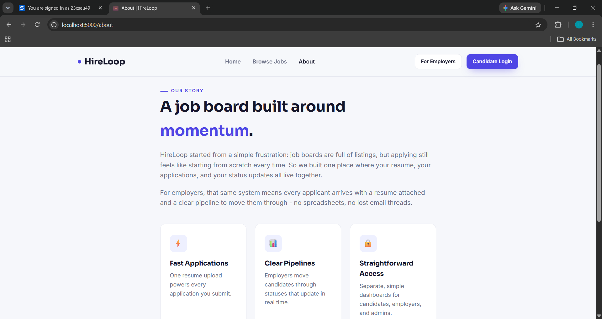
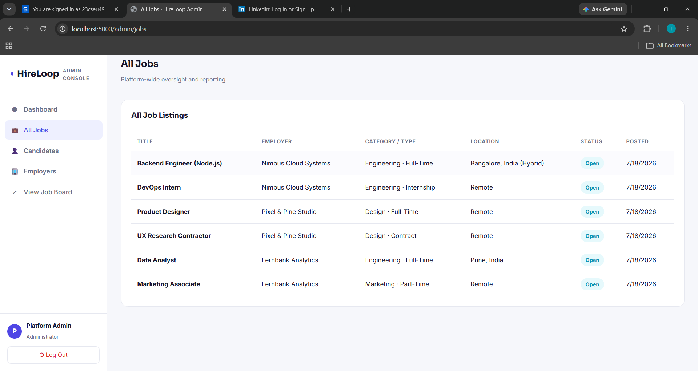
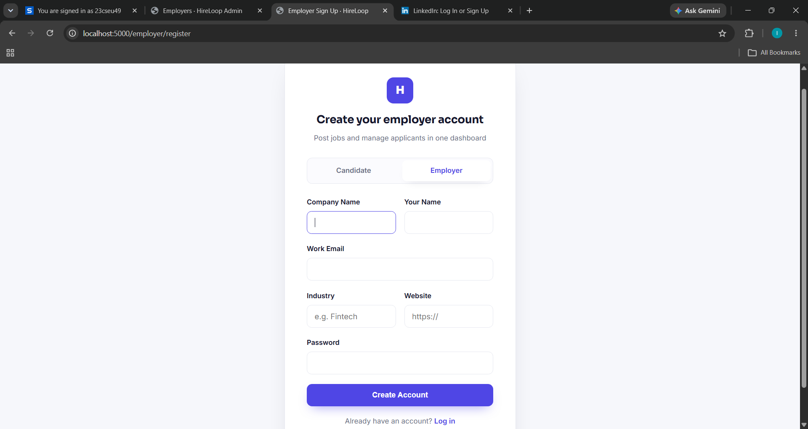
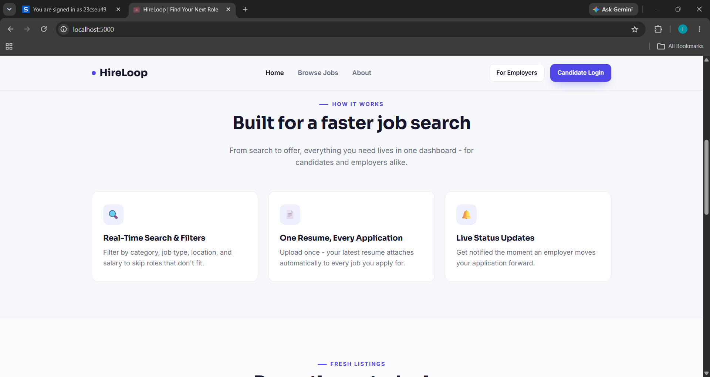

# 💼 HireLoop — Job Board Platform

A full-stack job board built with **Node.js, Express, MongoDB (Mongoose), EJS, and jQuery**.
Candidates search jobs, upload a resume, and apply in a couple of clicks. Employers post jobs and
move applicants through a pipeline. Admins get platform-wide stats and user management.

---

## ✨ Features

- **Public site**: landing page, live job search with filters (keyword, category, job type, location), job detail pages with an apply modal.
- **Candidates**: register/login, dashboard, resume upload (PDF/DOC/DOCX via real file upload), apply to jobs, track application status, edit profile/skills.
- **Employers**: register/login, dashboard, post/edit/close job listings, review applicants per job (resume link, cover letter, skills), move applications through `applied → shortlisted → interview → hired/rejected`.
- **Notifications**: employers get notified on new applicants; candidates get notified when their application status changes — shown via an in-app bell dropdown.
- **Admin panel**: platform stats (jobs, applications, users), application status breakdown, top jobs by applicant count, candidate/employer management (view + remove).
- Clean, modern **light SaaS UI** (indigo/violet theme), fully responsive, no page-reload interactions (all AJAX via jQuery).

---

## 📸 Screenshots

| | |
|---|---|
|  |  |
| **Landing Page** | **About** |
|  |  |
| **Job Details** | **Apply with Resume** |
|  |  |
| **Job Listings** | **Browse All Jobs** |
|  |  |
| **Employer Account** | **How It Works** |
|  |  |
| **Admin Panel** | **Employer Dashboard** |

---

## 🧱 Tech Stack

| Layer      | Tech                                          |
|------------|------------------------------------------------|
| Runtime    | Node.js + Express.js                          |
| Database   | MongoDB + Mongoose                            |
| Views      | EJS + express-ejs-layouts                     |
| Frontend   | jQuery (AJAX), vanilla CSS                    |
| Auth       | express-session + connect-mongo + bcryptjs (3 separate roles: candidate, employer, admin) |
| Uploads    | multer (resume files, stored on disk under `/public/uploads/resumes`) |
| Other      | dotenv, morgan, method-override, connect-flash |

---

## 📁 Folder Structure

```
04_job_board_platform/
├── index.js                  # Entry point
├── app.js                    # Express app config
├── package.json
├── .env.example
├── config/
│   ├── db.js                  # Mongoose connection
│   └── seed.js                # Seeds admin, 3 employers, 2 candidates, 6 jobs
├── models/                    # Employer, Candidate, Admin, JobListing, Resume, Application, Notification
├── controllers/                # authController, jobController, resumeController, applicationController,
│                                #   notificationController, adminController, candidateController, pageController
├── routes/                    # public pages, candidate/employer/admin pages + auth, /api/* resources
├── middleware/                 # auth.js (3-role session guards), upload.js (multer), errorHandler.js
├── views/
│   ├── partials/               # layout.ejs + candidate/employer/admin-layout.ejs, header, footer
│   ├── candidate/, employer/, admin/   # dashboards
│   └── *.ejs                   # index, jobs, job-detail, about, 404
└── public/
    ├── css/style.css            # single shared stylesheet (public site + all 3 dashboards)
    ├── js/                      # jobs.js, job-detail.js, candidate-*.js, employer-*.js, admin-*.js, notifications.js, toast.js
    └── uploads/resumes/         # uploaded resume files land here
```

---

## 🚀 Getting Started

### 1. Prerequisites
- Node.js v18+
- A MongoDB instance (local `mongod` or a free MongoDB Atlas cluster)

### 2. Install dependencies
```bash
cd 04_job_board_platform
npm install
```

### 3. Configure environment
```bash
cp .env.example .env
```
```env
PORT=5000
MONGO_URI=mongodb://127.0.0.1:27017/job_board_platform
SESSION_SECRET=change_this_secret
ADMIN_USERNAME=admin
ADMIN_PASSWORD=admin123
ADMIN_EMAIL=admin@jobboard.com
```

### 4. Seed sample data (recommended)
Creates a default admin, 3 employers, 2 candidates, and 6 job listings across different
categories/types so search filters and dashboards have real data immediately.
```bash
npm run seed
```

### 5. Run the server
```bash
npm run dev      # nodemon (auto-restart)
# or
npm start
```

Visit:
- **Website**: http://localhost:5000
- **Candidate login**: http://localhost:5000/candidate/login (seeded: `rhea.kapoor@example.com` / `password123`)
- **Employer login**: http://localhost:5000/employer/login (seeded: `hr@nimbuscloud.example` / `password123`)
- **Admin login**: http://localhost:5000/admin/login (from your `.env`, default `admin` / `admin123`)

---

## 🔄 How It Works

### Applying to a job
1. Candidate browses `/jobs`, opens a listing, clicks **Apply Now**.
2. If not logged in, the modal prompts a candidate login/register.
3. If logged in but no resume on file, the modal links to **My Resume** to upload one first.
4. On submit, `POST /api/applications` checks the job is still `open`, blocks duplicate applications
   (one application per candidate per job, enforced at the database level), attaches the selected
   (or primary) resume, creates the `Application`, and creates a **Notification** for the employer.

### Resume uploads
Candidates upload PDF/DOC/DOCX (max 5MB) via `POST /api/resumes` (multer, disk storage). The most
recent upload becomes the "primary" resume that auto-attaches to new applications; older ones stay
available to pick from at apply time or delete from **My Resume**.

### Application tracking & employer notifications
Employers open **Applicants**, pick one of their jobs, and update each applicant's status. Every
status change creates a **Notification** for that candidate, visible via the bell icon on their
dashboard. The same pattern notifies employers the moment someone new applies.

### Job search & filters
`GET /api/jobs` supports `q` (title/description/skills keyword), `category`, `jobType`, `location`,
and `minSalary` query params, combined with a Mongo `$or`/regex filter - open roles only by default.

### Admin reporting
`/admin/dashboard` aggregates total/open jobs, total applications, application status breakdown, and
the most-applied-to jobs directly from live collections (no mock numbers). `/admin/candidates` and
`/admin/employers` list and allow removing accounts.

---

## 🧩 Extending the Project
- Add email notifications (e.g. via nodemailer) alongside the in-app notification records.
- Add pagination to `/api/jobs` and the admin tables for larger datasets.
- Add employer team members / multiple admins per company.
- Swap file-based resume storage for S3 or another object store for production deployments.

---

## 🛠️ Troubleshooting
- **"MONGO_URI not found"** → copy `.env.example` to `.env`.
- **Can't log into admin** → run `npm run seed` first.
- **Job search returns nothing** → run `npm run seed` to populate sample jobs, or check your filters aren't too narrow.
- **Resume upload fails** → only `.pdf`, `.doc`, `.docx` under 5MB are accepted.
- **Port already in use** → change `PORT` in `.env`.

---

Every button, form, and API route in this codebase is wired to real MongoDB data — no placeholder
or mock responses anywhere in the flow.